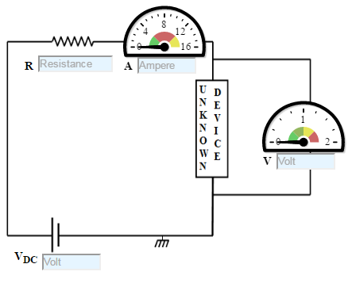
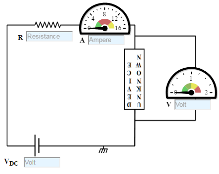

### Procedure

#### Experiment

- Let us go through the experiment of confirming and identifying the Unknown Device.

1. Set DC voltage(0-30 V).
2. Set the Resistance Value(1 Kohm - 100 Kohm) .
3. Voltmeter is placed parallel to resistor and ammeter series with resistor.
4. Now note the Voltmeter and Ammeter reading for DC voltage.
5. Increase the DC voltage by 2 factor and note Voltmeter and Ammeter Readings. Keep resistance value constant
6. Plot the V-I graph.
7. Repeat step 2 to 6 for another set of resistance value.
8. V versus I graph is a straight line.
9. Therefore from the graph we see that the resistance do adhere to Ohm’s law. Thus resistance is said to be an Ohmic device.

                                    

Figure:1

- Let us go through the experiment of confirming and identifying the Unknown Device.
1. Set DC voltage to 0.2 V .
2. Use the resistor of 1K ohms.
3. An Unknown device is connected in series with resistor.
4. Now vary the voltage upto 12V and note the Voltmeter and Ammeter reading for particular DC voltage .
5. Take 15 readings for better graph.
6. Take the readings and note Voltmeter reading across the unknown device and Ammeter reading.
7. Plot the V-I graph and observe the change.
8. From the graph if we see that the unknown device starts conducting when the forward bias voltage exceeds around 0.6 volts (for Si diode). Thus the device would be a Diode.
9. If we see that a straight curve is obtain then, it would be an ohmic device.

Figure: 2

- Confirming the identified Unknown Device by reversing the device.
1. Set DC voltage to 0.2 V .
2. Use the resistor of 1K ohms
3. Voltmeter is placed parallel to unknown device and ammeter series with resistor.
4. Now vary the voltage upto 6V and note the Voltmeter and Ammeter reading for DC voltage .
5. Take 15 readings for better graph.
6. Take the readings and note Voltmeter reading across unknown device and Ammeter reading.
7. Plot the V-I graph and observe the change.

Figure: 3

- Confirming the identified Unknown Device by unknown the device.
1. Intially, set input voltage to 5 V .
2. Use the resistor of 1K ohms.
3. An Unknown device is connected in series with resistor.
4. Now vary the frequecny and note the Voltmeter and Ammeter reading for AC test.
5. Take the readings and note Voltmeter reading across the unknown device and Ammeter reading.
6. Plot the graph and observe the change.
7. From the graph if we see that the unknown device starts conducting when the forward bias voltage exceeds around 0.6 volts (for Si diode). Thus the device would be a Diode.
8. If we see that a straight curve is obtain then, it would be an ohmic device.
9. If we see a charging upto input voltage, then it would be capacitance.

Figure: 4

